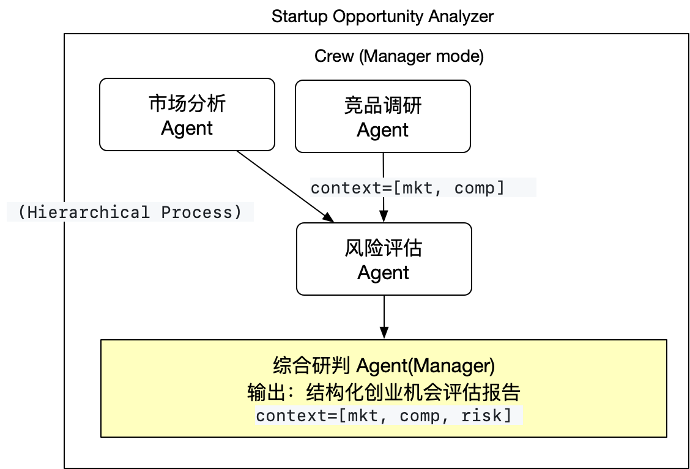
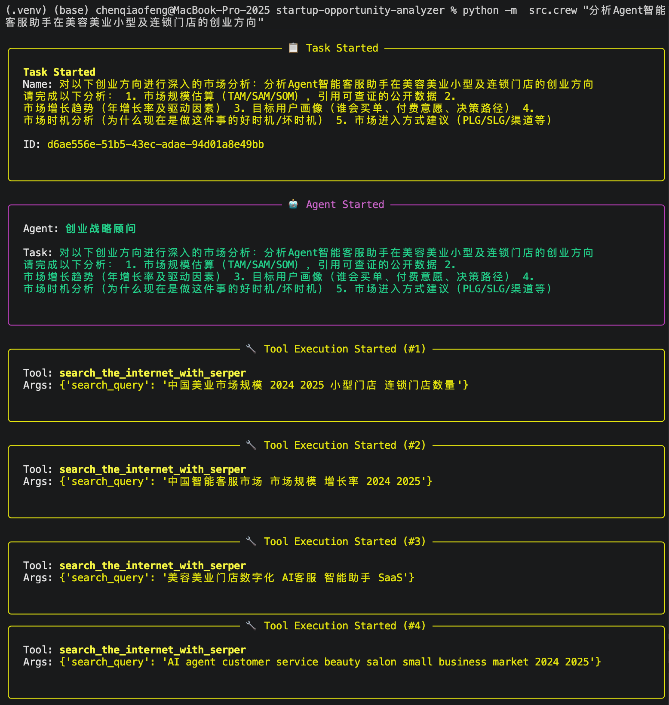

# Startup Opportunity Analyzer

基于 **CrewAI** 的多智能体创业机会分析系统。通过 5 个协作 Agent，自动完成市场分析、竞品调研、财务建模、风险评估，并输出 JSON Schema 格式的结构化创业机会评估报告。

LLM 本次项目采用的 deepseek-v4-pro，整体输出质量还不错。

整体项目还在持续优化阶段，希望大家可以提供宝贵的建议和意见，未来可预见 Agent 还是很大空间可以做点事情。

## 架构



5 个 Agent 协同工作：

| Agent | 角色 | 输出 | 工具 |
|-------|------|------|------|
| `market_analyst` | 资深市场分析师 | JSON（TAM/SAM/SOM、增长趋势、用户画像） | search + scrape |
| `competitor_researcher` | 竞品与行业调研专家 | JSON（竞品列表、竞争格局、差异化机会） | search + scrape |
| `finance_analyst` | 创业财务分析专家 | JSON（LTV/CAC 模型、定价策略、单位经济效益、资金需求） | search + scrape |
| `risk_reviewer` | 创业风险评审专家 | JSON（多维度风险列表、整体风险评级） | search |
| `strategy_advisor`（Manager） | 创业战略顾问 | JSON（Go/No-Go 决策、下一步行动计划、信心度） | — |

`strategy_advisor` 作为 Manager 协调前 4 个 Worker，所有 Worker 输出均为结构化 JSON，由 Manager 综合后输出最终决策报告。

## 技术栈

| 组件 | 选择 | 说明 |
|------|------|------|
| Agent 框架 | **CrewAI** (hierarchical process) | 角色驱动的多 Agent 协作 |
| LLM | DeepSeek V4 Pro | 中文理解 + 结构化输出稳定，推理能力稳定，且成本非常低 |
| 输出约束 | JSON Schema（自然语言描述） | DeepSeek 不支持 API 级别的 `response_format: json_schema`，所以通过 `expected_output` 字段描述 Schema 并手动解析 |
| 搜索 | Serper API | 中文搜索质量好，成本低，每次大概也就花费 40 次调用 |
| 网页抓取 | ScrapeWebsiteTool | CrewAI 内置 |
| 语言 | Python 3.11+ | |

## 为什么用 CrewAI 而不是 LangGraph？

本项目的核心场景是"多角色协作分析"——每个 Agent 有明确的角色定位和专业边界，CrewAI 的 role/goal/backstory 机制天然匹配这种需求。

| 维度 | CrewAI | LangGraph |
|------|--------|-----------|
| 驱动方式 | 角色驱动 | 状态图驱动 |
| 适合场景 | 模拟团队协作 | 复杂工作流控制 |
| 上手难度 | 低 | 中高 |
| 灵活性 | 中 | 高 |

详见 [docs/design_decisions.md](docs/design_decisions.md)

## 快速开始

```bash
# 1. 克隆项目
git clone https://github.com/jacobchan/startup-opportunity-analyzer.git
cd startup-opportunity-analyzer

# 2. 安装依赖（含 dev 依赖）
pip install -e ".[dev]"

# 2.1 激活环境（MacOS）
source .venv/bin/activate

# 3. 配置 API Key
cp .env.example .env
# 编辑 .env，填入你的 API Key

# 4. 运行分析
python -m examples.analyze_ai_agent
```

## 使用方式

### 方式一：运行预设示例

```bash
# 分析 AI Agent 客服平台方向
python -m examples.analyze_ai_agent

# 分析垂直 SaaS 方向
python -m examples.analyze_saas
```

- 启动 Agent 大军，开始干活：


### 方式二：自定义分析（命令行）

```bash
# 命令行直接指定方向
python -m src.crew "你的创业方向描述"

# 指定输出文件
python -m src.crew "你的创业方向描述" examples/output/my_report.md
```

不指定第二个参数时，报告只打印到终端，不会落盘。

### 方式三：作为模块集成（程序化调用）

```python
from src.crew import run_analysis

# 仅返回 JSON 字符串
report_json = run_analysis(
    startup_idea="面向物业管理的 AI Agent 平台，支持自动工单、智能巡检、业主服务"
)
print(report_json)

# 或直接保存到文件
report_json = run_analysis(
    startup_idea="面向物业管理的 AI Agent 平台",
    save_to="output/my_analysis.json",
)
```

### 方式四：作为模块集成，自定义 Agent 集合（高级用法）

如果需要修改 Agent 列表、任务依赖或流程控制，可以直接使用 `@CrewBase` 类：

```python
from src.crew import StartupAnalyzerCrew

analyzer = StartupAnalyzerCrew()
crew = analyzer.crew()  # 已配置好 5 个 Agent、5 个 Task、context 依赖

# 自定义输入
result = crew.kickoff(inputs={"startup_idea": "你的创业方向"})
print(result.raw)
```

你完全可以用 AI 快速 Gen 一个帅气的 UI 界面（例如 React），然后让它成为人机交互的界面。

## 示例输出


运行完成后会在 `examples/output/` 下生成 Markdown 格式的分析报告（或 JSON，取决于 `expected_output` 是否被 LLM 严格遵守），包含：

- **市场分析**：TAM/SAM/SOM 规模估算、增长趋势、用户画像
- **竞品分析**：竞品对比、商业模式拆解、差异化机会
- **财务分析**：LTV/CAC 模型、定价策略、单位经济效益、资金需求
- **风险评估**：技术/市场/团队/资金/政策多维度评级
- **综合研判**：Go/No-Go/Conditional-Go 建议 + 行动计划

具体如下：

有数据支撑：


## 项目结构

```
startup-opportunity-analyzer/
├── README.md
├── pyproject.toml
├── .env.example
├── src/
│   ├── crew.py              # Crew 定义（5 个 Agent + 5 个 Task + context 依赖）
│   ├── schemas.py           # 各 Agent 输出的 Pydantic 模型（Schema 定义）
│   ├── config/
│   │   ├── agents.yaml      # 5 个 Agent 的角色配置
│   │   ├── tasks.yaml       # 5 个 Task 定义（含 JSON Schema 描述）
│   │   └── settings.py      # 环境变量 & 全局配置
│   └── tools/
│       ├── search_tool.py   # Serper 搜索工具
│       └── web_scraper.py   # 网页内容提取
├── examples/
│   ├── analyze_ai_agent.py  # AI Agent 方向分析
│   ├── analyze_saas.py      # SaaS 方向分析
│   └── output/              # 分析报告输出
├── docs/
│   ├── architecture.md      # 系统架构详解
│   └── design_decisions.md  # 设计决策记录
└── tests/
    └── test_agents.py       # 配置加载 + Schema 验证测试
```

## 添加新 Agent

1. 在 `src/schemas.py` 中添加对应的 Pydantic 输出模型
2. 在 `src/config/agents.yaml` 中定义 Agent 的 role/goal/backstory
3. 在 `src/config/tasks.yaml` 中定义 Task，并在 `expected_output` 中描述 JSON Schema
4. 在 `src/crew.py` 中用 `@agent` 和 `@task` 装饰器注册，并按需设置 `context` 依赖

## 运行测试

```bash
pytest tests/
```

## License

「架构师创业笔记」（Personal, xiaohongshu 同名），有兴趣一起合作开发智能体的同伴，可以 email 随时联系我（`jacobchan5519@gmail.com`）
欢迎交流~~

## 前端开发

```bash
cd frontend
npm install
npm run dev        # 开发模式，端口 5173，自动代理后端
npm run build      # 生产构建
```

后端启动：

```bash
uvicorn src.web.app:create_app --factory --host 0.0.0.0 --port 8000
```

访问 `http://localhost:8000` 即可使用完整应用。

## 部署到阿里云 ECS

### 前置条件
- 阿里云 ECS 一台（2 vCPU / 4GB RAM 起步）
- 操作系统：Ubuntu 22.04 LTS
- 域名（可选，HTTPS 用）

### 部署步骤

```bash
# 1. 系统依赖
sudo apt update && sudo apt install -y python3.11 python3.11-venv nginx nodejs npm

# 2. 克隆代码
git clone https://github.com/jacobchan/startup-opportunity-analyzer.git
cd startup-opportunity-analyzer

# 3. Python 后端
python3.11 -m venv .venv
source .venv/bin/activate
pip install -e ".[dev]"

# 4. 配置环境变量
cp .env.example .env
# 编辑 .env：填入 DEEPSEEK_API_KEY / DEEPSEEK_BASE_URL / SERPER_API_KEY

# 5. 前端构建
cd frontend
npm install
npm run build
cd ..

# 6. 启动后端
uvicorn src.web.app:create_app --factory --host 0.0.0.0 --port 8000
```

### 用 systemd 管理进程

创建 `/etc/systemd/system/analyzer.service`：

```ini
[Unit]
Description=Startup Opportunity Analyzer
After=network.target

[Service]
Type=simple
User=ubuntu
WorkingDirectory=/home/ubuntu/startup-opportunity-analyzer
Environment="PATH=/home/ubuntu/startup-opportunity-analyzer/.venv/bin"
ExecStart=/home/ubuntu/startup-opportunity-analyzer/.venv/bin/uvicorn src.web.app:create_app --factory --host 127.0.0.1 --port 8000

[Install]
WantedBy=multi-user.target
```

```bash
sudo systemctl daemon-reload
sudo systemctl enable --now analyzer
sudo systemctl status analyzer
```

### 用 Nginx 反向代理 + HTTPS

```nginx
server {
    listen 80;
    server_name yourdomain.com;

    location / {
        proxy_pass http://127.0.0.1:8000;
        proxy_set_header Host $host;
        proxy_set_header X-Real-IP $remote_addr;

        # SSE 必须
        proxy_buffering off;
        proxy_cache off;
        proxy_set_header Connection '';
        proxy_http_version 1.1;
        chunked_transfer_encoding off;
    }
}
```

```bash
sudo ln -s /etc/nginx/sites-available/analyzer /etc/nginx/sites-enabled/
sudo nginx -t && sudo systemctl reload nginx
```

HTTPS 用 certbot：

```bash
sudo certbot --nginx -d yourdomain.com
```