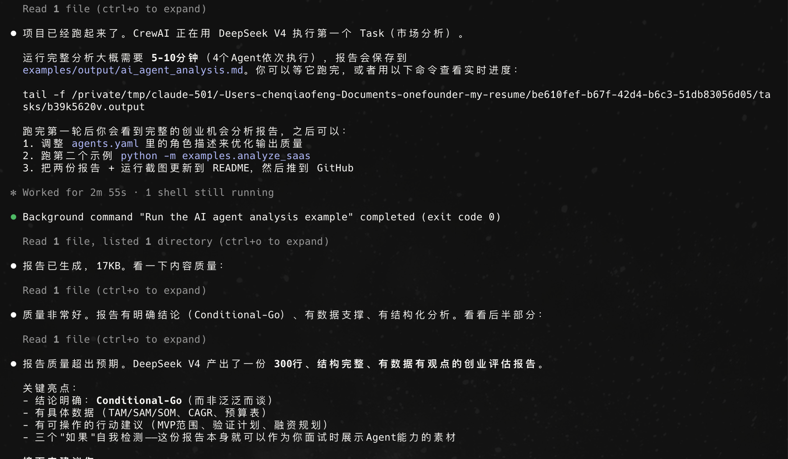
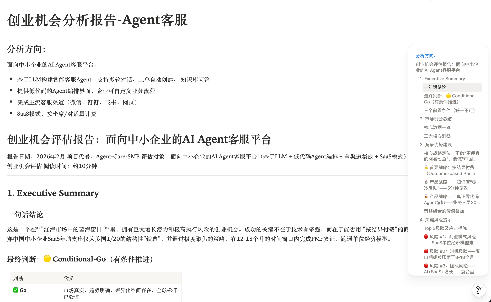
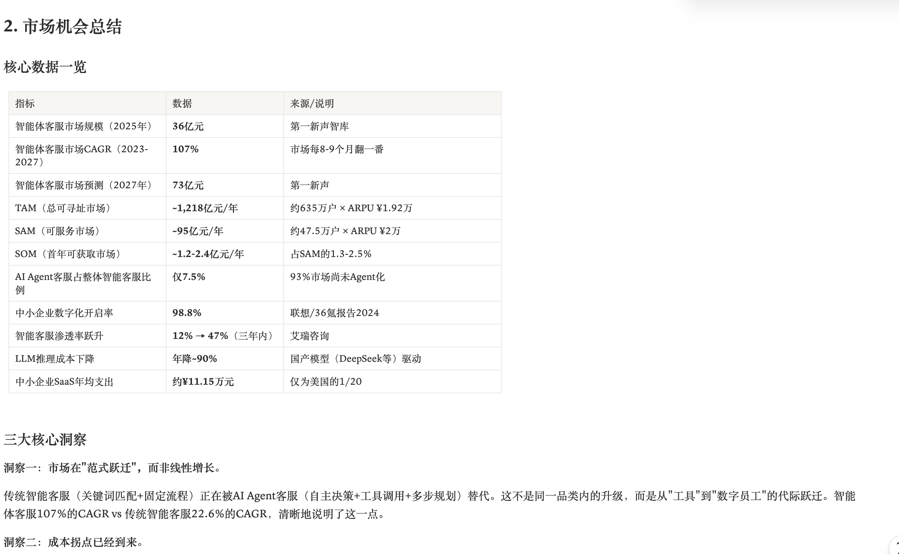

# Startup Opportunity Analyzer

基于 **CrewAI** 的多智能体创业机会分析系统。通过 4 个协作 Agent，自动完成市场分析、竞品调研、风险评估，并输出结构化创业机会评估报告。

LLM本次项目采用的deepseek-v4-pro，整体输出质量还不错。

整体项目还在持续优化阶段，希望大家可以提供宝贵的建议和意见，未来可预见Agent还是很大空间可以做点事情。

## 架构

```
┌──────────────────────────────────────────────┐
│          Crew (Hierarchical Process)          │
│                                              │
│  ┌──────────┐   ┌──────────┐   ┌──────────┐ │
│  │ 市场分析  │   │ 竞品调研  │   │ 风险评审  │ │
│  │  Agent   │ → │  Agent   │ → │  Agent   │ │
│  └──────────┘   └──────────┘   └──────────┘ │
│       ↓              ↓              ↓        │
│  ┌───────────────────────────────────────┐   │
│  │     综合研判 Agent (Manager)           │   │
│  │  输出：结构化创业机会评估报告           │   │
│  │  结论：Go / No-Go / Conditional-Go    │   │
│  └───────────────────────────────────────┘   │
└──────────────────────────────────────────────┘
```

## 技术栈

| 组件 | 选择 | 说明 |
|------|------|------|
| Agent框架 | **CrewAI** (hierarchical process) | 角色驱动的多Agent协作 |
| LLM | DeepSeek V4 Pro | 中文理解+结构化输出稳定,推理能力稳定，且成本非常低 |
| 搜索 | Serper API | 中文搜索质量好，成本低，每次大概也就花费40次调用 |
| 网页抓取 | ScrapeWebsiteTool | CrewAI内置 |
| 语言 | Python 3.11+ | |

## 为什么用 CrewAI 而不是 LangGraph？

本项目的核心场景是"多角色协作分析"——每个 Agent 有明确的角色定位和专业边界，CrewAI 的 role/goal/backstory 机制天然匹配这种需求。

| 维度 | CrewAI | LangGraph |
|------|--------|-----------|
| 驱动方式 | 角色驱动 | 状态图驱动 |
| 适合场景 | 模拟团队协作 | 复杂工作流控制 |
| 上手难度 | 低 | 中高 |
| 灵活性 | 中 | 高 |

详见 [docs/design_decisions.md](docs/design_decisions.md)

## 快速开始

```bash
# 1. 克隆项目
git clone https://github.com/jacobchan/startup-opportunity-analyzer.git
cd startup-opportunity-analyzer

# 2. 安装依赖
pip install -e ".[dev]"

# 3. 配置API Key
cp .env.example .env
# 编辑 .env，填入你的 API Key

# 4. 运行分析
python -m examples.analyze_ai_agent
```

## 使用方式

### 方式一：运行预设示例

```bash
# 分析AI Agent客服平台方向
python -m examples.analyze_ai_agent

# 分析垂直SaaS方向
python -m examples.analyze_saas
```

### 方式二：自定义分析

```bash
# 命令行直接指定方向
python src/crew.py "你的创业方向描述"

# 或在代码中调用
from src.crew import run_analysis

report = run_analysis(
    startup_idea="面向物业管理的AI Agent平台，支持自动工单、智能巡检、业主服务",
    save_to="output/my_analysis.md"
)
```

### 方式三：作为模块集成，你完全可以用AI快速Gen一个帅气的UI界面（例如React），然后让它成为人机交互的界面。

```python
from src.crew import create_agents, create_tasks, run_analysis

# 只创建Agent，自定义Crew配置
agents = create_agents()
tasks = create_tasks(agents, "你的创业方向")

from crewai import Crew, Process
crew = Crew(
    agents=list(agents.values()),
    tasks=tasks,
    process=Process.sequential,  # 可切换为sequential模式
)
result = crew.kickoff()
```

## 示例输出


运行完成后会在 `examples/output/` 下生成 Markdown 格式的分析报告，包含：

- **市场分析**：TAM/SAM/SOM规模估算、增长趋势、用户画像
- **竞品分析**：竞品对比、商业模式拆解、差异化机会
- **风险评估**：技术/市场/团队/资金/政策多维度评级
- **综合研判**：Go/No-Go/Conditional-Go 建议 + 行动计划

具体如下：

有数据支撑：

## 项目结构

```
startup-opportunity-analyzer/
├── README.md
├── pyproject.toml
├── .env.example
├── src/
│   ├── crew.py              # Crew定义 & 执行入口
│   ├── config/
│   │   ├── agents.yaml      # Agent角色配置
│   │   ├── tasks.yaml       # Task定义（支持参数注入）
│   │   └── settings.py      # 环境变量 & 全局配置
│   ├── tools/
│   │   ├── search_tool.py   # Serper搜索工具
│   │   └── web_scraper.py   # 网页内容提取
│   ├── agents/              # Agent模块（可扩展）
│   └── tasks/               # Task模块（可扩展）
├── examples/
│   ├── analyze_ai_agent.py  # AI Agent方向分析
│   ├── analyze_saas.py      # SaaS方向分析
│   └── output/              # 分析报告输出
├── docs/
│   └── design_decisions.md  # 设计决策记录
└── tests/
    └── test_agents.py       # 配置加载测试
```

## 运行测试

```bash
pytest tests/
```

## License

架构师创业笔记（Personal,xiaohongshu同名），有兴趣一起合作开发智能体的同伴，可以email随时联系我（`jacobchan5519@gmail.com`）
欢迎交流~~
